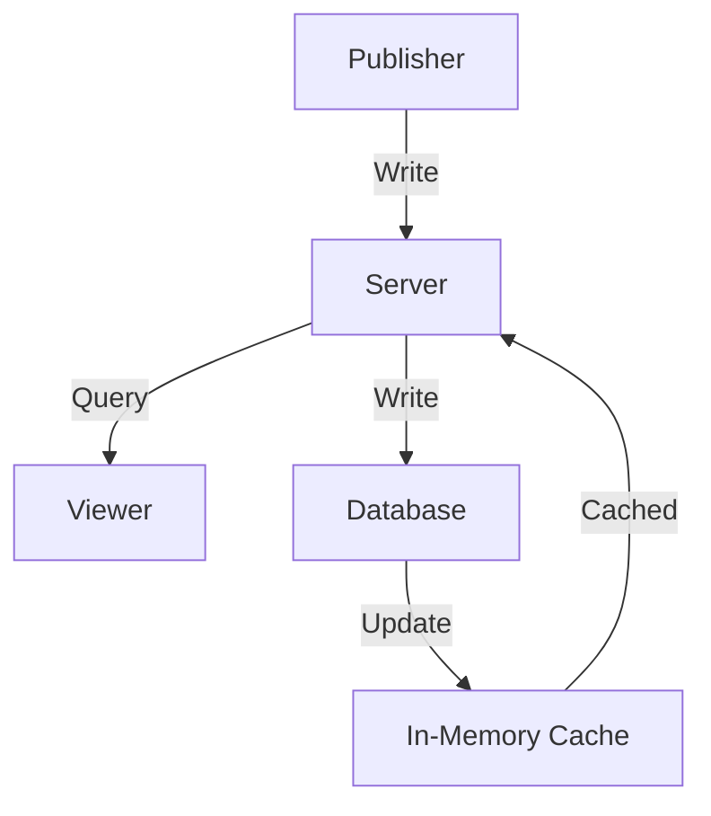

# Dcard Backend HW

## Goal
Use Golang to design an api server for ads service.
This service includes two services, add new ads and search ads.

This would be admin api to create ads.
The following ad is to create the people who is 20-30 and use Android or iOS.
```
curl -X POST -H "Content-Type: application/json" \
    "http://localhost:8080/api/v1/ad" \
    --data '{
        "title": "AD 55",
        "startAt": "2023-12-10T03:00:00.000Z",
        "endAt": "2023-12-31T16:00:00.000Z",
        "conditions": [
            {
                "ageStart": 20,
                "ageEnd": 30,
                "country: ["TW", "JP"],
                "platform": ["android", "ios"]
            }
        ]
    }'
```

This would be the public api for people to search ads.
```
curl -X GET -H "Content-Type: application/json" \
    "http://localhost:8080/api/v1/ad?offset=10&limit=3&age=24&gender=F&country=TW&platform=ios"
```
And the response would be:
```
{
    "items": [
        {
            "title": "AD 1",
            "endAt": "2023-12-22T01:00:00.000Z"
        },
        {
            "title": "AD 31",
            "endAt": "2023-12-30T12:00:00.000Z"
        },
        {
            "title": "AD 10",
            "endAt": "2023-12-31T16:00:00.000Z"
        }
    ]
}
```

## Design
High performance for the Request operation is the primary goal.
Considering the number of people who use public api may be a lot, we have to make sure that this api support high performance.
On the other hand, the number of people who use admin api may be a little, we can serve them later.

I just simply cache the ads in memory and update every second.

!image()


